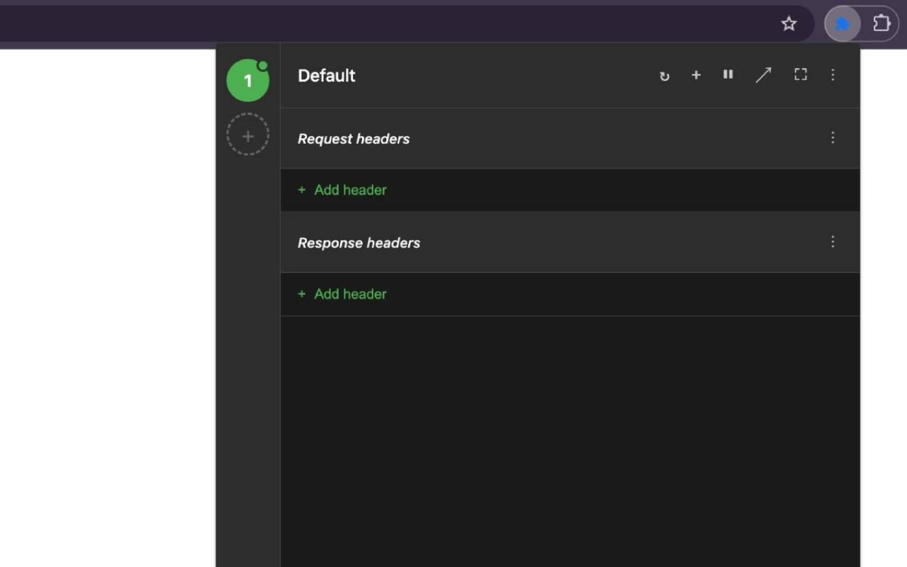

# Header Editor Pro - Free

<div align="center">

🚀 **Professional HTTP Header Editor for Chrome & Firefox** 🚀

*Completely free alternative to paid header modification tools*


[](https://github.com/testacode/header-editor-pro-free)


</div>

## ✨ Features

🔥 **100% FREE** - No subscriptions, no premium features, no limitations  
🎯 **Unlimited Profiles** - Create as many header configurations as you need  
⚡ **Real-time Header Modification** - Instant application via Chrome's declarativeNetRequest API  
🎨 **Professional Dark UI** - Clean, modern interface designed for developers  
☑️ **Individual Header Controls** - Enable/disable each header independently  
⏸️ **Pause Functionality** - Temporarily disable without losing configurations  
🔒 **Privacy Focused** - All data stored locally, no tracking or analytics  

## 🎯 Perfect For

- **Web Developers** - Testing API responses and CORS configurations
- **QA Testers** - Simulating different environments and conditions  
- **API Testing** - Adding authentication headers and custom parameters
- **Debugging** - Troubleshooting header-related issues
- **Development** - Local testing with modified headers

## 📸 Screenshots

<div align="center">



*Professional dark interface with profile circles, header management, and clean design*

</div>

## 🚀 Installation

### Chrome Web Store (Recommended)
1. Visit the [Chrome Web Store](https://chromewebstore.google.com/detail/cpdkigffbilaglfmddclhgfflimpaeim)
2. Click "Add to Chrome"
3. Click "Add Extension" in the popup

### Firefox Add-ons (Recommended)
1. Visit [Firefox Add-ons](#) (link coming soon)
2. Click "Add to Firefox"
3. Click "Add" in the confirmation popup

### Manual Installation (Developer Mode)

#### Chrome
1. Download or clone this repository
2. Open Chrome and go to `chrome://extensions`
3. Enable "Developer mode" (top right)
4. Click "Load unpacked" and select the project folder
5. The extension icon will appear in your toolbar

#### Firefox
1. Download or clone this repository
2. Open Firefox and go to `about:debugging`
3. Click "This Firefox" in the sidebar
4. Click "Load Temporary Add-on"
5. Select the `manifest.json` file from the project folder

## 💡 How to Use

### Basic Usage
1. **Click the extension icon** in Chrome toolbar
2. **Create profiles** using the numbered circles in the sidebar
3. **Add headers** by clicking the "+" button or "Add header" buttons
4. **Enable/disable** individual headers using checkboxes
5. **Switch profiles** by clicking different numbered circles

### Profile Management
- **Create new profile**: Click the "+" circle at bottom of sidebar
- **Switch profiles**: Click any numbered circle
- **Delete profile**: Right-click on a profile circle (except default)
- **Import/Export profiles**: Use the import/export buttons in the toolbar to share configurations as JSON; importing a JSON file exported from ModHeader creates one profile per ModHeader profile (note: response headers and URL filters are not supported and will not be imported)
- **Active indicator**: Green circle = active, red = inactive

### Header Controls
- **Add headers**: Use "Add header" buttons in the request headers section
- **Edit headers**: Type directly in name/value fields
- **Enable/disable**: Use checkboxes next to each header
- **Delete headers**: Click the "✕" button

### Toolbar Features
- **Pause/Resume**: ⏸️/▶️ button to temporarily disable all modifications
- **Profile name**: Shows current active profile
- **Quick add**: "+" button to add request headers

## 🔧 Technical Details

### Cross-Browser Compatibility
🌟 **Single Codebase** - Same extension works on both Chrome and Firefox using Manifest V3  
⚡ **Universal APIs** - Uses standard WebExtensions APIs supported by both browsers  
🔧 **Automatic Detection** - Extension adapts to browser-specific features automatically

### Permissions Used
- **declarativeNetRequest**: Modify HTTP headers efficiently
- **storage**: Save configurations locally on your device  
- **activeTab**: Apply headers to current tab
- **host permissions**: Modify headers across all websites

### Data Privacy
✅ **No data collection** - Extension doesn't track or collect any personal data  
✅ **Local storage only** - All configurations stored on your device  
✅ **No external servers** - No data transmitted anywhere  
✅ **Open source** - Full transparency of all code  

## 🆚 Why Choose Header Editor Pro - Free?

| Feature | Header Editor Pro - Free | Other Extensions |
|---------|-------------------------|------------------|
| **Price** | 🟢 Completely Free | 🔴 $5-15/month subscriptions |
| **Profiles** | 🟢 Unlimited | 🔴 3 profiles max (free tier) |
| **UI Quality** | 🟢 Professional dark theme | 🔴 Basic/outdated interfaces |
| **Privacy** | 🟢 No tracking/analytics | 🔴 Often collect usage data |
| **Open Source** | 🟢 Full transparency | 🔴 Proprietary/closed source |

## 🛠️ Development

### Project Structure
```
├── src/                  # Source code (Rspack bundling)
│   ├── manifest.json    # Unified config for Chrome & Firefox
│   ├── popup/           # UI components (HTML, CSS, JS)
│   ├── background/      # Service worker logic
│   ├── pages/           # Privacy policy and other pages
│   └── assets/icons/    # Extension icons (16px-128px)
├── dist/                # Built extension (gitignored)
├── rspack.config.js     # Rspack bundler configuration
├── package.json         # Dependencies and build scripts
├── scripts/             # Release automation scripts
├── .github/workflows/   # GitHub Actions for automated builds
├── screenshots/         # Extension screenshots
├── index.html           # Landing page (GitHub Pages)
├── privacy.html         # Privacy policy page
├── 404.html             # Custom 404 page
├── robots.txt           # SEO crawlers configuration
├── sitemap.xml          # SEO sitemap
└── og-image.png         # Open Graph image for social sharing
```

### Local Development
1. Clone the repository
2. Install dependencies: `npm install`
3. Start development server: `npm run dev`
4. Make changes to files in `src/`
5. Go to `chrome://extensions`
6. Click "Reload" on the extension card
7. Test your changes

### Build Process
The extension uses **Rspack** (23x faster than Webpack) for bundling:
- **Minification**: Code optimized for performance
- **Cross-browser**: Single build works for Chrome & Firefox  
- **No obfuscation**: Store-compliant minification only
- **Source maps**: Available in development mode

### 🚀 Creating Releases

#### Option 1: Automated Script (Recommended)
```bash
# Interactive release script (Mac/Linux)
./scripts/release.sh

# Cross-platform Node.js version  
node scripts/release.js
```

**The script will:**
- Update version in manifest.json
- Create proper git commit and tag
- Push to GitHub (triggers automated ZIP build)
- Generate versioned files: `header-editor-pro-free-extension-vX.X.X.zip`
- Guide you through the entire process

#### Option 2: Manual Process
```bash
# Update version in manifest.json first, then:
git add .
git commit -m "release: bump version to 1.1.0"
git tag v1.1.0
git push origin main --tags
```

Both methods trigger **GitHub Actions** to automatically build the extension ZIP and create a GitHub release.

## 📦 Distribution & Stores

### Download Options
- **GitHub Releases**: Get the latest versioned ZIP files directly
- **Chrome Web Store**: [Install from Chrome Web Store](https://chromewebstore.google.com/detail/cpdkigffbilaglfmddclhgfflimpaeim)
- **Firefox Add-ons**: Coming soon - official AMO listing

### Package Files
When you download from GitHub releases, you'll get:
- `header-editor-pro-free-extension-vX.X.X.zip` - Ready for both Chrome & Firefox
- `header-editor-pro-free-source-vX.X.X.zip` - Source code for Firefox reviewers

### Store Compliance
- ✅ **Minified code only** - No obfuscation (store policies compliant)
- ✅ **Single manifest** - Works for both Chrome and Firefox  
- ✅ **Privacy focused** - No tracking, local storage only
- ✅ **Open source** - Full transparency for reviewers

### Contributing
Contributions are welcome! Please:
1. Fork the repository
2. Create a feature branch
3. Make your changes
4. Test thoroughly
5. Submit a pull request

## 📄 License

This project is licensed under the MIT License - see the [LICENSE](LICENSE) file for details.

## 🤝 Support

- **Website**: [testacode.github.io/header-editor-pro-free](https://testacode.github.io/header-editor-pro-free/)
- **Issues**: [GitHub Issues](https://github.com/testacode/header-editor-pro-free/issues)
- **Privacy Policy**: [View Policy](https://testacode.github.io/header-editor-pro-free/privacy.html)
- **Documentation**: This README and inline code comments

## 💖 Support This Project

If you find Header Editor Pro - Free helpful, consider supporting its development:

[](https://buymeacoffee.com/charlybrown)
[](https://github.com/sponsors/testacode)

Your support helps keep this extension **completely free** and actively maintained for the developer community!

## 🌟 Show Your Support

If you find this extension helpful:
- ⭐ Star this repository
- 🔄 Share with fellow developers
- 🐛 Report bugs and suggest features
- 📝 Contribute to the codebase
- ☕ Buy me a coffee to fuel development

---

<div align="center">

**Made with ❤️ for the developer community**

*Free alternative to expensive header modification tools*

</div>