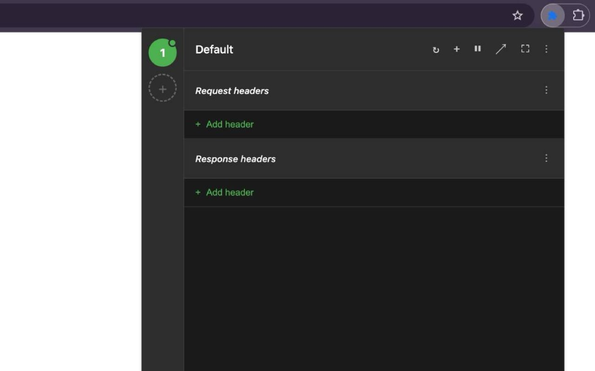

# Header Editor Pro - Free

🚀 **Professional HTTP Header Editor for Chrome & Firefox** 🚀

*Completely free alternative to paid header modification tools*

## ✨ Features

🔥 **100% FREE** - No subscriptions, no premium features, no limitations  
🎯 **Unlimited Profiles** - Create as many header configurations as you need  
⚡ **Real-time Header Modification** - Instant application of request and response headers via the declarativeNetRequest API  
🎨 **Professional Dark UI** - Clean, modern interface designed for developers  
☑️ **Individual Header Controls** - Enable/disable each header independently  
📋 **Copy to Another Profile** - Per-row dropdown to copy a header into another profile's matching section  
🎯 **Profile Filters** - Scope a profile to specific domains, or to a Chrome tab group so headers never leak outside it  
🌐 **7 Languages** - English, 简体中文, 繁體中文, 日本語, 한국어, Русский and Español, switchable from the toolbar ([spot a bad translation?](https://github.com/testacode/header-editor-pro-free/issues/new?template=translation.yml))  
🔄 **Drag & Drop Reordering** - Reorganize headers by dragging them  
⏸️ **Pause Functionality** - Temporarily disable without losing configurations  
🔒 **Privacy Focused** - All data stored locally, no tracking or analytics  

Built for web developers, QA testers and anyone debugging API auth flows, CORS
or environment-specific behaviour.

## 🚀 Installation

- **Chrome**: [Chrome Web Store](https://chromewebstore.google.com/detail/cpdkigffbilaglfmddclhgfflimpaeim) → "Add to Chrome"
- **Firefox**: [Firefox Add-ons](https://addons.mozilla.org/en-US/firefox/addon/header-editor-pro-free/) → "Add to Firefox"
- **From source**: see [docs/development.md](docs/development.md)

## 📖 Documentation

| Guide | What's in it |
|---|---|
| [Usage](docs/usage.md) | Profiles, headers, filters, toolbar, permissions |
| [Development](docs/development.md) | Project structure, local setup, build, releases |
| [i18n](docs/i18n.md) | How translations work, in the extension and on the site |
| [Gotchas](docs/GOTCHAS.md) | Hard-won bugs and undocumented behaviour |

## 🆚 Why Choose Header Editor Pro - Free?

| Feature | Header Editor Pro - Free | Other Extensions |
|---------|-------------------------|------------------|
| **Price** | 🟢 Completely Free | 🔴 $5-15/month subscriptions |
| **Profiles** | 🟢 Unlimited | 🔴 3 profiles max (free tier) |
| **UI Quality** | 🟢 Professional dark theme | 🔴 Basic/outdated interfaces |
| **Privacy** | 🟢 No tracking/analytics | 🔴 Often collect usage data |
| **Open Source** | 🟢 Full transparency | 🔴 Proprietary/closed source |

## 🔒 Privacy

No data collection, no analytics, no external servers. Every configuration stays
in local storage on your device, and the code is open for you to check.
Full [privacy policy](https://testacode.github.io/header-editor-pro-free/privacy.html).

## 💖 Support This Project

This extension costs nothing, and nobody pays me to maintain it or to build new
things into it. It gets better in my own time.

**Want something improved?** [Open an issue](https://github.com/testacode/header-editor-pro-free/issues)
and let's talk it through — that's free too, and it's the best way in.

Chip in and your request moves up my queue. And if you'd rather not, no hard
feelings — nobody ever turned down a glass of water ;)

Either way, it stays free for everyone. Starring the repo and sharing it with
other developers helps just as much.

## 🔗 Links

- **Website**: [testacode.github.io/header-editor-pro-free](https://testacode.github.io/header-editor-pro-free/)
- **Issues**: [GitHub Issues](https://github.com/testacode/header-editor-pro-free/issues)
- **License**: [MIT](LICENSE)

---

**Made with ❤️ for the developer community**

